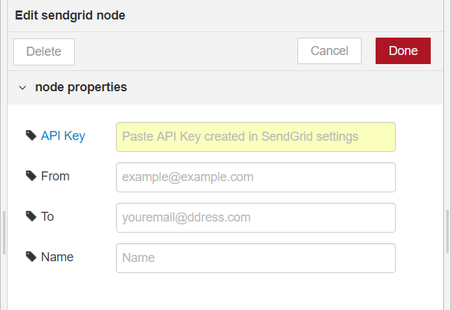
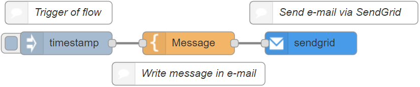

# node-red-contrib-sendgrid

Sending e-mail node using SendGrid service

Default e-mail node sometimes encounters login problem occurred from unusual behavior. For example, Gmail authentication will show an alert when Node-RED runtime is located in the different location from user's local PC or smart phone. SendGrid node is able to solve the problem because SendGrid service ensures sending e-mail.

## How to use 
(1) Install SendGrid node (node-red-contrib-sendgrid) using manage palette in Node-RED

(2) Get API key from SendGrid website ( https://sendgrid.com/ )

(3) Paste the API key on property of SendGrid node

(4) Create flows using SendGrid node

## SendGrid node specification
Sends the <code>msg.payload</code> as an email, with a subject of <code>msg.topic</code>. The default message recipient can be configured in the node, if it is left blank it should be set using the <code>msg.to</code> property of the incoming message. you can also specify <code>msg.cc</code> and/or <code>msg.bcc</code> properties. You can set sender of <code>msg.from</code> in the payload.
